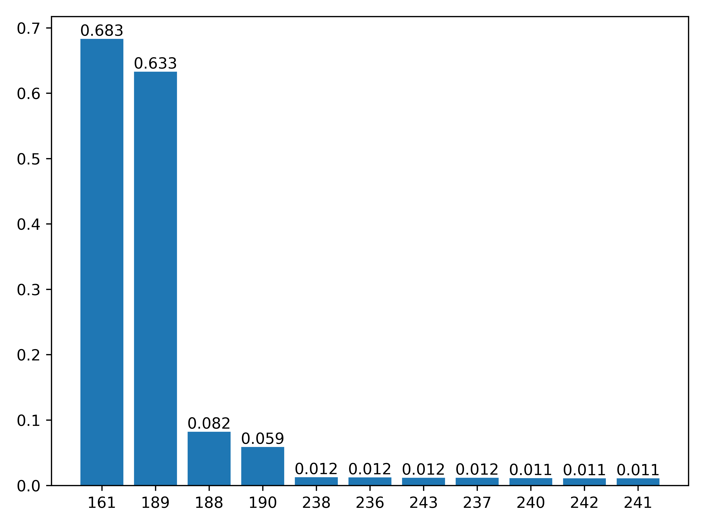

# Reactive power adjustment method of non-convergent power flow for power system operation mode calculation

This is the unofficial implementation of the paper: "Zeng H, Guo Q, Zhou Y, et al. Reactive power adjustment method of non-convergent power flow for power system operation mode calculation[J]. Power System Protection and Control, 2022, 50(19): 1-12."

A robust power flow solver implementing a Levenberg-Marquardt inspired method with Lagrange multipliers for handling active and reactive power subproblems. Designed for enhanced convergence in heavily loaded power systems.

## Key Features
- 🏭 MATPOWER/PyPower standard case support (e.g., case300)
- ⚡ Handles non-convergent scenarios
- 🔄 Dual subproblem decomposition (active/reactive)
- 📈 Adaptive parameter tuning for convergence
- 📊 Residual monitoring and visualization
- 🎛️ Configurable optimization parameters

## Requirements
```bash
pip install numpy scipy matplotlib pypower
# For sparse QR decomposition (required by active subproblem solver):
pip install sparseq
```

## Usage

### Basic 

```python
from pypower.api import case300
from lm_adjust import lm_adjust
ppc = case300()
ppc['bus'][:, [PD, QD]] *= 1.5  # Create 150% load scenario
ppc['gen'][:, [PG, QG]] *= 1.5  # Scale generation accordingly
solution, Fp, Fq, Fq_current = lm_adjust(ppc, 
                                       k_max=1000, 
                                       epsilon=1e-3,
                                       verbose=True)
```

The return value of lm_adjust are solution vector (PV angle; PQ angle and PQ magnitude), residual array of active/reactive subproblem and the final reactive residual for power flow adjustment.

### Algorithm Parameters

| Parameter     | Default | Description                          |
|---------------|---------|--------------------------------------|
| `k_max`       | 10000   | Maximum iterations                   |
| `epsilon`     | 1e-2    | Convergence threshold                |
| `sigma0`      | 1e-4    | Trust region confidence lower bound for step size update          |
| `sigma1`      | 0.5    | Trust region confidence lower bound  for damping factor update          |
| `sigma2`      | 0.9    |Trust region confidence upper bound  for damping factor update          |
| `C`      | 10.0    | Adaptive factor amplification/attenuation coefficient          |
| `alpha_max`   | 1e8     | Upper bound of the adaptive factor $\alpha_k$ corresponding to the damping factor $\delta_k$   |
| `beta_min`    | 1e-8    | Lower bound of the adaptive factor $\beta_k$ corresponding to the damping factor $\gamma_k$       |
| `alpha_0`   | 1e-4     | Initial value for $\alpha_k$   |
| `beta_0`    | 0.1    | Initial value for $\beta_k$          |
| `r0`   | 1.0     |  Initial value for penalty factor $r_k$   |
| `rho_epsilon`    | 1e-6   | Update constant for the penalty factor $r_k$ |

## Results

The companion main.py generates two diagnostic plots:

1. **Residual Convergence**: Logarithmic-scale residuals of active/reactive subproblems
   

2. **Reactive Power Violations**: Top 10 buses with largest reactive mismatches
   

## License
[MIT License](LICENSE)